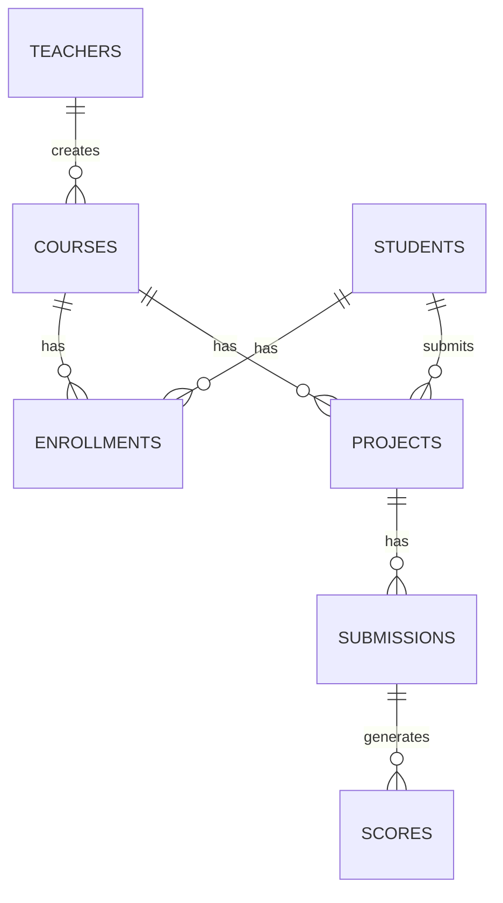

# 🗄️ Database Schema — AI Teaching Assistant

> **Database:** PostgreSQL  
> **ORM/Query:** Raw `pg` Pool queries (as in your existing [db.js](file:///c:/Users/rahul/Desktop/Agentic_instructor/backend/db.js))

---

## Entity Relationship Overview



---

## Table Definitions (SQL)

### 1. `teachers`
```sql
CREATE TABLE teachers (
    id          SERIAL PRIMARY KEY,
    teacher_id  VARCHAR(20) UNIQUE NOT NULL,  -- college staff ID e.g. "TCH2024001"
    name        VARCHAR(100) NOT NULL,
    email       VARCHAR(150) UNIQUE NOT NULL,
    password_hash TEXT NOT NULL,
    created_at  TIMESTAMPTZ DEFAULT NOW()
);
```

---

### 2. `students`
```sql
CREATE TABLE students (
    id          SERIAL PRIMARY KEY,
    student_id  VARCHAR(20) UNIQUE NOT NULL,  -- enrollment no. e.g. "STU2024001"
    name        VARCHAR(100) NOT NULL,
    email       VARCHAR(150) UNIQUE,
    password_hash TEXT NOT NULL,
    created_at  TIMESTAMPTZ DEFAULT NOW()
);
```

---

### 3. `courses`
```sql
CREATE TABLE courses (
    id                  SERIAL PRIMARY KEY,
    course_code         VARCHAR(20) UNIQUE NOT NULL,  -- e.g. "CS301-2024"
    title               VARCHAR(200) NOT NULL,
    description         TEXT NOT NULL,
    curriculum          TEXT NOT NULL,   -- topics covered (used by agents)
    learning_objectives TEXT NOT NULL,   -- what students should achieve
    evaluation_criteria TEXT NOT NULL,   -- how projects are judged (used by Agent 2)
    teacher_id          INT REFERENCES teachers(id) ON DELETE CASCADE,
    created_at          TIMESTAMPTZ DEFAULT NOW()
);
```

> 💡 `course_code` is the ID shared with students to join the course.

---

### 4. `enrollments`
```sql
CREATE TABLE enrollments (
    id         SERIAL PRIMARY KEY,
    student_id INT REFERENCES students(id) ON DELETE CASCADE,
    course_id  INT REFERENCES courses(id) ON DELETE CASCADE,
    joined_at  TIMESTAMPTZ DEFAULT NOW(),
    UNIQUE(student_id, course_id)   -- a student can join a course only once
);
```

---

### 5. `projects`
```sql
CREATE TABLE projects (
    id           SERIAL PRIMARY KEY,
    student_id   INT REFERENCES students(id) ON DELETE CASCADE,
    course_id    INT REFERENCES courses(id) ON DELETE CASCADE,
    title        VARCHAR(200) NOT NULL,
    idea_text    TEXT NOT NULL,             -- student's idea description
    agent_status VARCHAR(20) DEFAULT 'pending',  -- 'pending' | 'approved' | 'rejected'
    agent_feedback TEXT,                    -- Agent 1 feedback
    created_at   TIMESTAMPTZ DEFAULT NOW(),
    UNIQUE(student_id, course_id)           -- one project per student per course
);
```

---

### 6. `submissions`
```sql
CREATE TABLE submissions (
    id            SERIAL PRIMARY KEY,
    project_id    INT REFERENCES projects(id) ON DELETE CASCADE,
    milestone     VARCHAR(100) NOT NULL,    -- e.g. "Milestone 1", "Final Submission"
    progress_notes TEXT,                   -- student's written update
    file_paths    TEXT[],                  -- array of stored file paths/URLs
    submitted_at  TIMESTAMPTZ DEFAULT NOW()
);
```

---

### 7. `scores`
```sql
CREATE TABLE scores (
    id            SERIAL PRIMARY KEY,
    submission_id INT REFERENCES submissions(id) ON DELETE CASCADE,
    project_id    INT REFERENCES projects(id) ON DELETE CASCADE,
    score         NUMERIC(5,2) NOT NULL,   -- e.g. 87.50 out of 100
    feedback      TEXT,                    -- Agent 2 detailed feedback
    is_final      BOOLEAN DEFAULT FALSE,   -- TRUE for end-of-semester final score
    evaluated_at  TIMESTAMPTZ DEFAULT NOW()
);
```

---

## Key Design Decisions

| Decision | Reason |
|----------|--------|
| `teachers.teacher_id` / `students.student_id` are VARCHAR college IDs | Single-college system; no need for external auth |
| `courses.curriculum` and `evaluation_criteria` are plain TEXT | Passed directly to AI agents as context |
| `projects.agent_status` tracks idea approval state | Prevents submissions without an approved idea |
| `submissions.file_paths` is a `TEXT[]` array | Allows multiple files per submission |
| `scores.is_final` flag | Differentiates milestone scores from end-of-semester final |

---

## Indexes (Performance)

```sql
CREATE INDEX idx_enrollments_student ON enrollments(student_id);
CREATE INDEX idx_enrollments_course  ON enrollments(course_id);
CREATE INDEX idx_projects_course     ON projects(course_id);
CREATE INDEX idx_submissions_project ON submissions(project_id);
CREATE INDEX idx_scores_project      ON scores(project_id);
```
